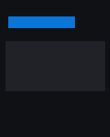

A first read takes about ten seconds once the tag is in your hand. Most
of that is finding the spot on the phone where the antenna sits, which
is further up the back than people expect.

## Before you start

Fixture App uses the NFC reader in the phone, so there is nothing to
pair and nothing to charge. Any iPhone from the iPhone 7 onwards,
running iOS 16 or later, can read a tag.

You need a tag the reader can talk to, and a clear path to it:

- [x] An iPhone 7 or later running iOS 16 or newer
- [x] Fixture App 1.0 or later, installed from the App Store
- [ ] An NTAG 213, NTAG 215 or MIFARE Ultralight tag
- [ ] A case thinner than 3 mm, or no case at all

::include[safety-note]

Not every tag answers. MIFARE Classic tags stay silent on iPhone
because the reader does not speak their protocol, and some access
control tags answer only after a password exchange. The
[Chip support matrix](../reference/chip-support.md) lists the chips
that have been tested against version 1.0.

## Read the tag

::::steps
:::step[Open the Scan sheet]
Tap the large circle in the middle of the Library screen, or press and
hold the app icon on the Home Screen and choose Scan. The sheet slides
up and the status line reads "Ready for a tag".

The reader stays awake for 60 seconds. If nothing comes within range
the sheet closes itself, and nothing is added to the Library.
:::

:::step[Hold the tag against the top of the phone]
Rest the top edge of the phone flat against the tag and keep both
still. The status line changes to "Tag detected" and the phone plays a
short tick.

Position matters more than pressure:

- The antenna runs across the top edge, about a centimetre below the
  camera bar.
- Keep the tag square to the phone rather than at an angle.
- Move a MagSafe wallet or a metal card out of the way first.
:::

:::step[Check the records and save]
When the read finishes the sheet lists every NDEF record on the tag, in
the order they are stored. Fixture App recognises URL, text and Wi-Fi
records and shows a preview of each one. Anything else is listed as raw
bytes.

Tap Save to keep the tag, or Discard to close the sheet without writing
anything to the Library.
:::
::::

:::figure[The Scan sheet, waiting for a tag to come within range]

:::

:::warning[A partial read looks like a success]
Tags with a password-protected area answer the first part of a read and
refuse the rest. Fixture App shows what it got and puts "Records
incomplete" under the tag name. Look for that line before you trust a
read of an access control tag.
:::

:::tip
Turn on Settings > Scanning > Keep sheet open to read several tags in
one go. The Library groups everything from that session under a single
heading.
:::

## After the read

Saved tags land in the Library, newest first, with the chip type and
the time of the read under the name. Tapping one opens Tag detail,
which shows the raw bytes beside the decoded records.

Renaming a tag changes only what you see in the Library. Nothing is
written back to the tag itself unless you use the Write sheet, which is
a separate procedure.

## If the read does not finish

The reader retries on its own. The first two attempts happen quietly,
within about a second of each other. From the third attempt the sheet
starts reporting what it is doing:

3. "Still looking" appears in the status line and the tick stops.
4. The reader falls back to a slower polling rate.
5. The session ends with "Tag lost before the read finished".

A read that reaches the fifth attempt twice in a row is usually the
tag, not the phone. [When a scan does not work](troubleshooting.md)
walks through the causes in the order worth checking them.
